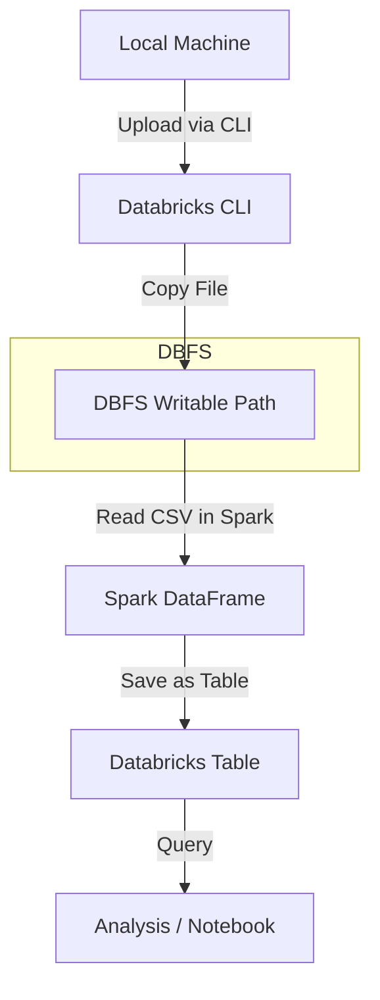

# Databricks Beginner Guide – File Upload & CLI Setup

## 1. Overview

This guide helps beginners set up Databricks CLI, upload files from their local machine, and work with Spark tables. Topics include:

- Installing Databricks CLI
- Generating Personal Access Tokens (PATs)
- Configuring CLI
- Uploading files to DBFS
- Creating storage volumes and schemas
- Reading and writing CSVs in Spark
- Common troubleshooting tips

---

## 2. Install Databricks CLI

Open **PowerShell** or **Command Prompt** and run:

```bash
pip install --upgrade databricks-cli
```

Verify installation:

```bash
databricks --version
# Should show 0.18.x or higher
```

---

## 3. Generate Personal Access Token (PAT)

1. Log in to your Databricks workspace.
2. Click **User Icon → Settings → Developer → Access Tokens**.
3. Click **Generate new token**.
4. Copy the token exactly as shown (single line, no spaces or quotes).

**Important Notes:**

- Ensure the token is copied **in a single line**.
- Do not share your PAT publicly.

---

## 4. Databricks Workspace URL

- Azure: `https://<your-instance>.azuredatabricks.net/`
- AWS: `https://<your-instance>.databricks.com/`

**Rules:**

- Must start with `https://`
- Must **not** end with `/`

✅ Correct: `https://dbc-xxxx.cloud.databricks.com`
❌ Wrong: `https://dbc-xxxx.cloud.databricks.com/`

---

## 5. Configure Databricks CLI

Run the configuration command:

```bash
databricks configure --token
```

It will prompt for:

```
Databricks Host: https://<your-instance>.databricks.com
Token: <paste your PAT here>
```

Test configuration:

```bash
databricks fs ls dbfs:/
```

**If you face issues:**

- Ensure token has no spaces or newlines
- Check workspace URL
- Confirm CLI version is latest (>=0.18.x)

---

## 6. DBFS Paths & File Upload

### 6.1 Recommended Writable Paths

- `/FileStore/` → Writable for all users
- `/user/<username>/` → Personal home directory
- `/Volumes/<volume-name>/` → Attached volume for catalogs/schemas

### 6.2 Create Volume & Schema (Optional)

1. Go to **Databricks Catalog → Create Schema → Attach or create Volume**
2. Example path: `dbfs:/Volumes/workspace/test/test_vol/`

### 6.3 Upload File via CLI

```bash
databricks fs cp "C:/path/to/local/file.csv" dbfs:/FileStore/file.csv
```

Verify upload:

```bash
databricks fs ls dbfs:/FileStore/
```

---

## 7. Read/Write CSV in Databricks

### 7.1 Read CSV

```python
df = spark.read.csv("dbfs:/FileStore/file.csv", header=True, inferSchema=True)
display(df)
```

### 7.2 Save as Table

```python
# Create database if not exists
spark.sql("CREATE DATABASE IF NOT EXISTS my_db")

# Save DataFrame as table
df.write.mode("overwrite").saveAsTable("my_db.my_table")
```

### 7.3 Query Table

```python
# Using PySpark
df_sql = spark.sql("SELECT * FROM my_db.my_table")
display(df_sql)

# Or using notebook SQL magic
%sql
SELECT * FROM my_db.my_table
```

---

## 8. Workflow Diagram



**Explanation:**

1. **Local Machine** – source CSV/data files
2. **Databricks CLI** – authenticates and uploads files
3. **DBFS Writable Path** – `/FileStore/`, `/user/`, or `/Volumes/`
4. **Spark DataFrame** – reads CSV for processing
5. **Databricks Table** – save processed DataFrame as table
6. **Analysis/Notebook** – query and visualize table

---

## 9. Common Issues & Fixes

| Error | Cause | Fix |
|-------|-------|-----|
| AccessDenied | Writing to read-only path | Use `/FileStore/` or personal DBFS folder |
| AttributeError: 'DataFrameWriter' object has no attribute 'saveastable' | Python is case-sensitive | Use `saveAsTable` instead |
| Authorization failed | Invalid/expired token or wrong URL | Regenerate token, check URL, ensure CLI version >=0.18.x |
| File upload fails | DBFS folder/volume not created | Create volume → schema → attach volume → then upload |

---

## 10. Tips & Best Practices

- Always use `/FileStore/` or `/user/<username>/` in Community Edition
- Keep PAT secure; never share publicly
- Use CLI for automating file uploads
- Ensure volumes/schemas are correctly attached before writing tables
- Use `display(df)` in notebooks for visual data inspection

